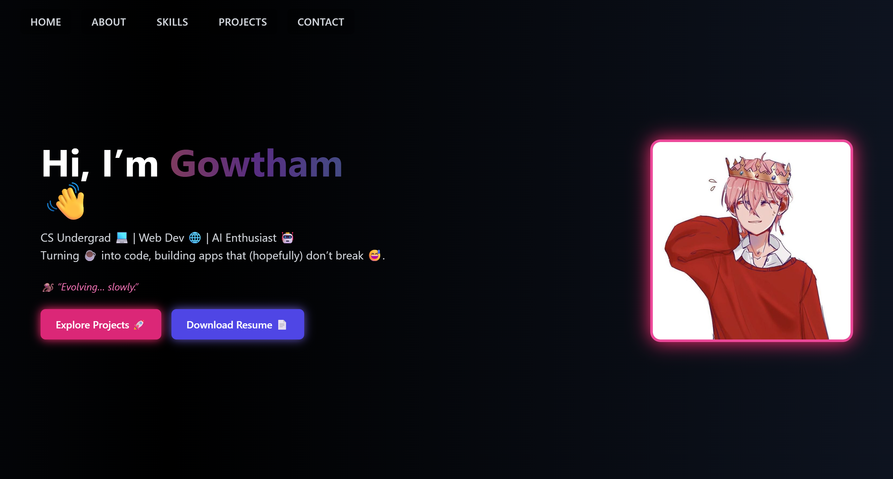

# 🌐 Personal Portfolio Website  

This is my **personal portfolio website** built with **React, Tailwind CSS, Framer Motion, and tsParticles**.  
It showcases my **skills, projects, education, and experience** in a modern, responsive, and interactive design.  

---

## 🚀 Features  
- 🎨 **Modern UI/UX** with responsive design  
- ✨ **Animated Hero Section** with particle background  
- 🖼️ Neon-style **cards for skills, education, and projects**  
- 📂 **Projects section** with live demo & GitHub links  
- 📱 Fully **mobile-friendly**  
- 🔗 Easy navigation with smooth scroll  

---

## 🛠️ Tech Stack  
- **React.js** – Component-based UI  
- **Tailwind CSS** – Utility-first styling  
- **Framer Motion** – Smooth animations  
- **tsParticles** – Interactive particle background  
- **JavaScript (ES6+)**  

---

## 🔗 Live Demo  
👉 [Visit My Portfolio](https://gowtham4235.vercel.app/)  

---

## 🖼️ Preview  

  

---
